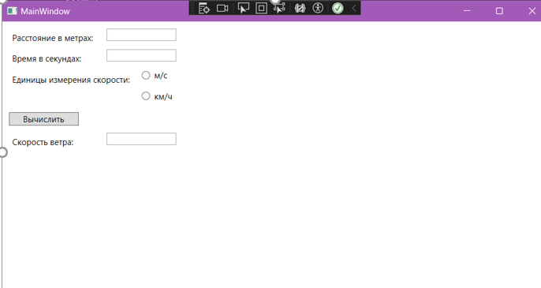

В этом проекте были использованы способы отладки в Microsoft Visual Studio:
Точки останова: Использовались для остановки выполнения кода в определенных местах, что позволяло проверять значения переменных и состояние программы.

